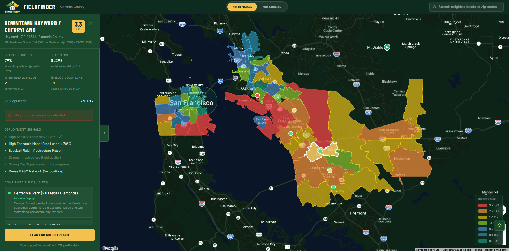

# FieldFinder

A baseball access mapping application created for the **0xide × Oakland Ballers Hackathon**, where it received **First Place in the Community Impact category** and was presented at an Oakland Ballers game.

## What It Does

FieldFinder identifies neighborhoods across Alameda and San Francisco counties where youth need the most support for baseball programs. It scores each neighborhood based on:

- **Social vulnerability** (economic distress, lack of resources)
- **Baseball infrastructure** (fields, facilities, community centers)
- **Existing program coverage** (RBI, Little League, Parks & Rec)

Areas with **high need and low program coverage** are prioritized as the best places to expand RBI baseball programs.

## Impact

FieldFinder solves a critical challenge: **Where should RBI expand next?** Instead of guessing based on hunches, the app provides data-driven rankings that identify genuine gaps in youth baseball access. By combining census vulnerability data with on-the-ground infrastructure assessment, it helps RBI officials make faster, more informed deployment decisions and reach more underserved youth.

## Getting Started

To install and run the project locally, see [QUICK_START.md](./QUICK_START.md).

For technical details on how neighborhoods are scored, see [SCORING_GUIDE.md](./SCORING_GUIDE.md).

---

## Features

- **Interactive choropleth map** showing neighborhood need scores with color-coded priority levels
- **Dual view modes**:
  - **RBI Officials view**: Optimized for program placement decisions with deployment signals
  - **Families view**: Community program discovery—find the nearest baseball organizations and programs in your neighborhood
- **Program search**: Find what RBI and baseball programs are nearby your neighborhood
- **Deployment signals**: Key indicators (SVI, field count, economic need) for RBI leaders to evaluate readiness
- **Dark stadium aesthetic**: UI optimized for use in stadium environments during games

---

## Tech Stack

- **Frontend**: React 18 + TypeScript + Vite + TailwindCSS
- **Backend**: Express + Node.js
- **Maps**: Google Maps JavaScript API
- **Data**: Hardcoded neighborhoods and programs (designed to expand to live databases)

---

## License

MIT
